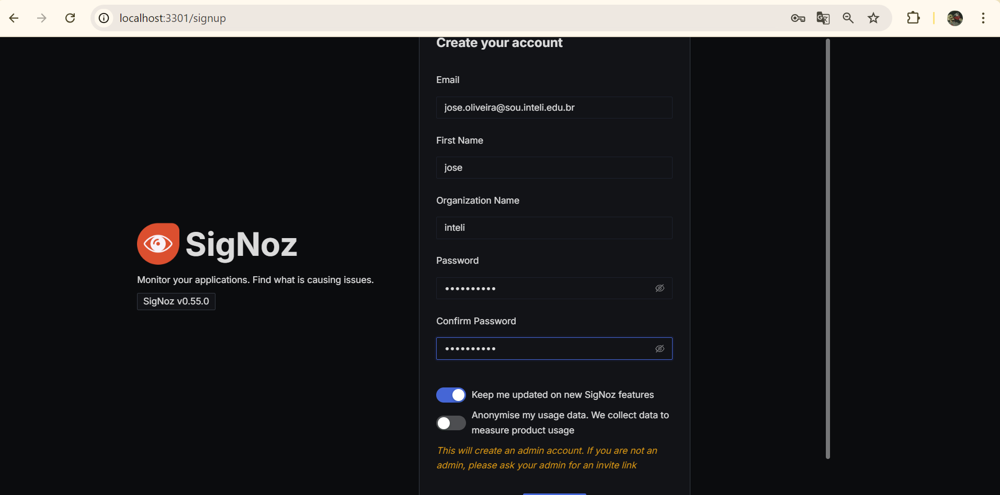
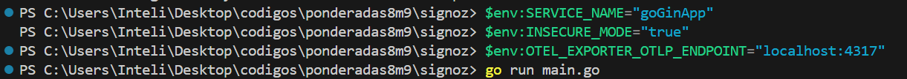
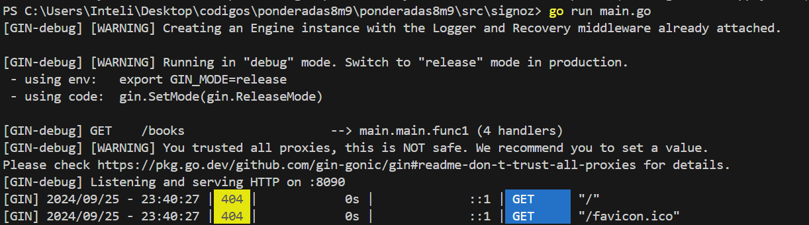

# Testes para Aplicações Go com Gin e OpenTelemetry Usando TDD

## Introdução
O Desenvolvimento Orientado a Testes (TDD) é uma abordagem que prioriza a criação de testes antes do desenvolvimento da funcionalidade. No contexto de aplicações Go utilizando Gin e OpenTelemetry, o TDD assegura que a aplicação atenda aos requisitos desde o início, facilitando um desenvolvimento contínuo e confiável. Esta metodologia permite que as equipes desenvolvam aplicações mais robustas e mantenham a qualidade do código.

## Estrutura do Projeto
Antes de começar, vamos definir a estrutura básica do nosso projeto Go. A seguir, uma possível estrutura:

```
/goGinApp
|-- main.go
|-- main_test.go
|-- go.mod
```

### Instalação
Para iniciar um novo projeto Go com Gin e OpenTelemetry, siga os seguintes passos:

Nesse projeto também utilizamos o Sigmoz




1. **Crie um novo diretório para o projeto** e entre nele:
   ```bash
   mkdir goGinApp
   cd goGinApp
   ```

2. **Inicialize o módulo Go**:
   ```bash
   go mod init goGinApp
   ```

3. **Instale as dependências**:
   ```bash
   go get github.com/gin-gonic/gin
   go get go.opentelemetry.io/contrib/instrumentation/github.com/gin-gonic/gin/otelgin
   go get go.opentelemetry.io/otel
   go get go.opentelemetry.io/otel/sdk/resource
   go get go.opentelemetry.io/otel/sdk/trace
   ```

Também é importante setar as variáveis necessárias



## Desenvolvimento Orientado a Testes (TDD)
O TDD segue três etapas principais:

1. **Red (Vermelho)**: Escrever testes que falham porque a funcionalidade ainda não foi implementada.
2. **Green (Verde)**: Implementar o código mínimo necessário para passar nos testes.
3. **Refactor (Refatorar)**: Melhorar o código mantendo os testes passando.

### Etapa Red: Escrever Testes que Falham
Na fase inicial, escrevemos testes que falharão, pois a funcionalidade ainda não foi implementada. O objetivo é definir claramente o que a funcionalidade deve fazer.




#### Teste para o Manipulador de Rota `/books`
Crie um arquivo `main_test.go` e adicione os seguintes testes:

```go
package main

import (
	"net/http"
	"net/http/httptest"
	"testing"

	"github.com/gin-gonic/gin"
	"github.com/stretchr/testify/assert"
)

func TestBooksHandler(t *testing.T) {
	gin.SetMode(gin.TestMode)

	r := gin.Default()
	r.GET("/books", BooksHandler)

	req, _ := http.NewRequest("GET", "/books", nil)
	w := httptest.NewRecorder()
	r.ServeHTTP(w, req)

	assert.Equal(t, http.StatusOK, w.Code)
	assert.Contains(t, w.Body.String(), "List of books")
}
```

### Etapa Green: Implementar Código para Passar os Testes
Agora, vamos implementar o código mínimo necessário para que os testes passem.


#### Implementação do Manipulador de Rota
No arquivo `main.go`, implemente o manipulador `/books`:

```go
func BooksHandler(c *gin.Context) {
	c.JSON(http.StatusOK, gin.H{
		"message": "List of books",
	})
}
```

### Etapa Refactor: Melhorar o Código Mantendo os Testes Passando
Na fase de refatoração, você pode melhorar o código para torná-lo mais organizado.

#### Código Refatorado
O código para o manipulador `/books` já está bem estruturado, mas podemos refatorar o código da inicialização do servidor:

```go
func main() {
	// Inicializa o tracer
	cleanup := initTracer()
	defer cleanup(context.Background())

	// Configuração do Gin e do Middleware OpenTelemetry
	r := gin.Default()
	r.Use(otelgin.Middleware(serviceName))

	// Define uma rota para a raiz
	r.GET("/", func(c *gin.Context) {
		c.JSON(http.StatusOK, gin.H{
			"message": "Welcome to the Go Gin App!",
		})
	})

	// Define rota para /books
	r.GET("/books", BooksHandler)

	// Inicia o servidor
	if err := r.Run(":8090"); err != nil {
		log.Fatalf("Error starting server: %v", err)
	}
}
```

## Conclusão
O Desenvolvimento Orientado a Testes (TDD) para aplicações Go com Gin e OpenTelemetry é fundamental para garantir a qualidade e a robustez do código. Ao adotar o TDD, você define claramente os requisitos antes de implementar a funcionalidade, permitindo detectar erros precocemente e facilitando a manutenção do código. Os testes unitários e de integração garantem que cada parte da aplicação funcione corretamente, resultando em um desenvolvimento mais estruturado e confiável. Essa abordagem não apenas melhora a qualidade do código, mas também promove a confiança na evolução contínua da aplicação.

--- 
